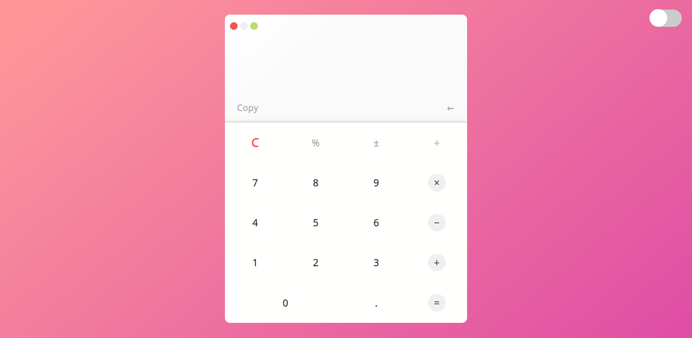
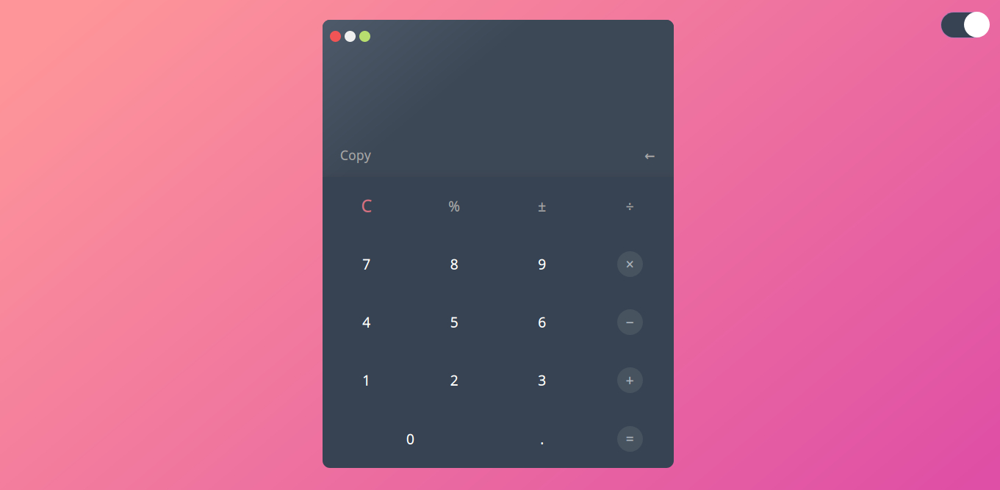

# Calculator
This a simple calculator as a web application it's make the simple operation easily and correct, You could also copy the result to your clipboard and there is night mode also.

## Table of content

* [General info](#general-info)
* [Screenshots](#screenshots)
* [Technologies](#technologies)
* [Setup](#setup)
* [Features](#features)
* [Status](#status)
* [Inspiration](#inspiration)

## General info
I made this project because it was challenging to me to do the operation without any special data stracture it's like "stack", It improves my ability and my way of thinking and make me understand how the machine think.

##Screenshots 

## Technologies
This project is created with:-

* HTML
* CSS
* Vanilla javaScript

## Setup
To run this project go to this live preview --> https://htmlpreview.github.io/?https://github.com/sheehaab/Calculator/blob/master/index.html

## Features

* Make all the simple operation
* Night mode
* Simple UI

## Status
Project is finished.

## Inspiration
Project inspired by @TheOdinProject

